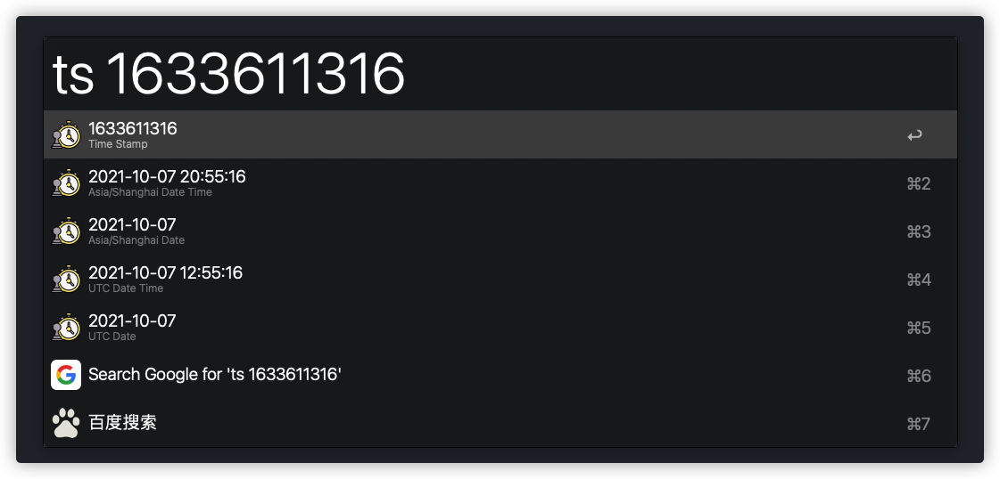
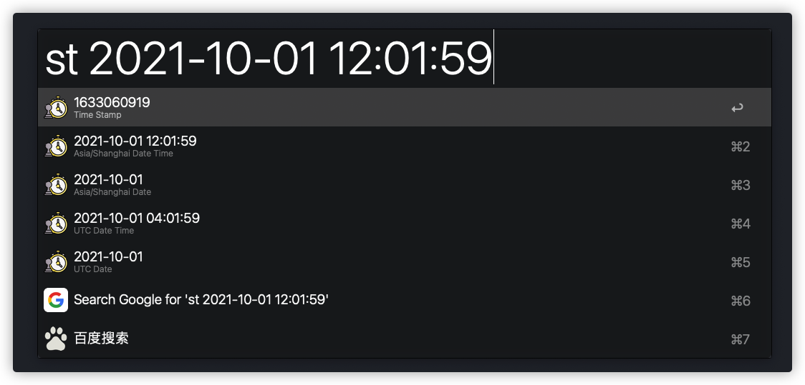
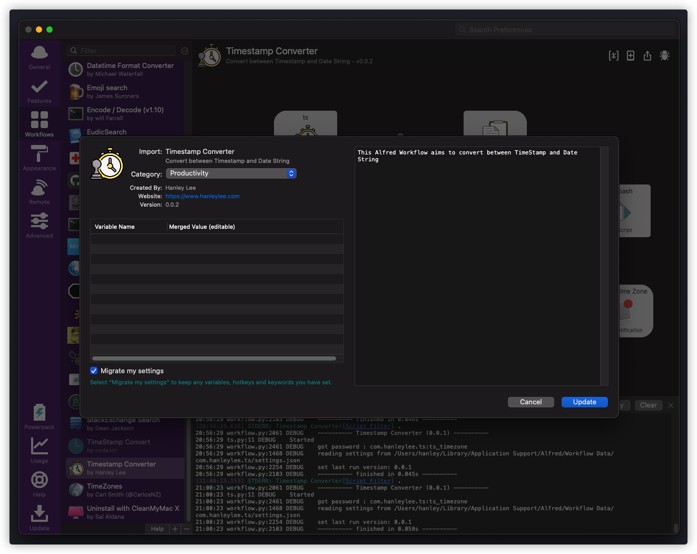

# Alfred Timestamp Converter

This Alfred Workflow aims to convert between *TimeStamp* and *Date String*

## Installation

1. Go to [Releases](https://github.com/HanleyLee/alfred-timestamp-converter-workflow/releases) page to download the latest release file named
   *Timestamp Converter.alfredworkflow*
2. Double click `Timestamp Converter.alfredworkflow` in your local folder

    

3. 安装完成

## IMPORTANT

**First of all, you must set your local timezone by type `setzone` in your Alfred to let this plugin know how to show!**

## Usage

- `ts`: **Convert from TimeStamp to Data String**, *TimeStamp* -> *String*
- `st`: **Convert frome Date String to TimeStamp**, *String* -> *TimeStamp*

### ts

You can also use `ts ms 1633611316000` to specify it to using **millisecond**. This workflow will use **second** by default

### st

## TODO

- Auto update the plugin itself

## Ref

- [deanishe/alfred-workflow](https://github.com/deanishe/alfred-workflow)

## Disclaimer

All codes in directory *src/workflow* / *src/pytz* / *src/dateutil* are dependencies from this project. They're not my work and is the only
"dependency" for this project. Since it's included in this repo, the workflow user doesn't have to concern about dependencies.

## License

All codes in this warehouse are distributed and used based on [Apache License 2.0](http://www.apache.org/licenses/LICENSE-2.0). For the full text of
the agreement, see [LICENSE](https://github.com/HanleyLee/Handy/blob/main/LICENSE) file.

Copyright 2021 HanleyLee

---

Welcome, if you have any bugs, I hope to raise issues. If it is useful to you, please mark a star ⭐️
